<center>
<h1>Práctica de SOA</h1>
<h2>Servicios REST usando JEE (Jersey + Jetty), lanzados con Heroku, usando NLP via API.ai e integrados con Facebook Messenger</h2>
<h3>Arquitecturas y Tecnologías del Software</h3>
<br/>
<h4>Autores</h4>
<b>David Lozano Jarque (NIU 1359958)</b>
<b>Carlos González Cebrecos (NIU 1212586)</b>
<b>Adrián Soria Bonilla (NIU 1360940)</b>
<br/>
Escuela de Ingeniería, Universidad Autónoma de Barcelona
Curso 2016-2017
</center>
<div style="page-break-after: always;"></div>

# Introducción
En esta práctica, desarrollaremos un [_chatbot_](https://es.wikipedia.org/wiki/Bot_conversacional) en la plataforma [_Facebook_](https://www.facebook.com), usando su producto de chat [_Facebook Messenger_](https://es-es.messenger.com). Para ello, usaremos [_API.ai_](https://api.api) con el objetivo de reconocer el lenguaje natural [_NLP_](https://en.wikipedia.org/wiki/Natural_language_processing) e interpretarlo para ofrecer respuestas coherentes.

Finalmente, usaremos un sevicio web [_REST_](https://en.wikipedia.org/wiki/Representational_state_transfer) que implementaremos usando [_Jersey_](https://jersey.java.net), servido usando [_Jetty_](https://www.eclipse.org/jetty) y lo publicaremos mediante [_Heroku_](https://heroku.com) para que sea accesible públicamente. Éste servicio web REST lo usaremos para que [_API.ai_](https://api.api) pueda obtener mediante nuestra API datos relevantes, en éste caso, le proveeremos del estado meteorológico dada una ciudad que _API.ai_ nos interpretará a partir de los mensajes recibidos en _Facebook Messenger_.

<center>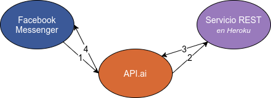</center>


## Creación del _chatbot_ en _Facebook Messenger_
En primer lugar, para poder empezar a unir todos estos servicios tenemos que estar registrados en todas las plataformas. Empezaremos realizando el registro en [_Facebook Developer_](https://developer.facebook.com) (que requiere previo registro en la red social _Facebook_) para poder desarrollar aplicaciones sobre _Facebook_, en nuestro caso el _chatbot_. También deberemos crear una página de Facebook para vincular nuestro _chatbot_ con ésta.

Una vez en la plataforma de desarrolladores y habiendo creado una página en la red social, crearemos una aplicación.

<center></center>

<center>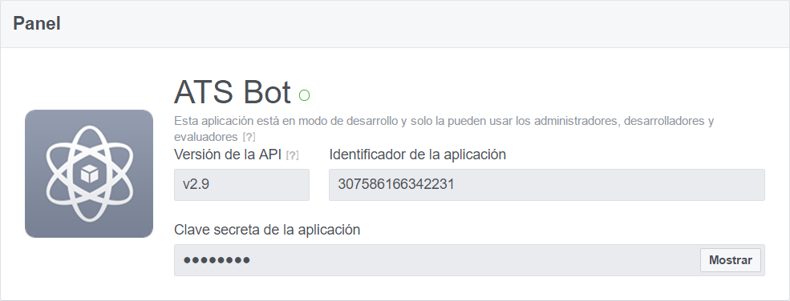</center>

Una vez creada la aplicación en _Facebook_ ya podremos conectar un _chatbot_ con la plataforma _API.ai_

### Conexión con [_API.ai_](https://api.ai)
#### Registro
Comenzaremos por registrarnos en [api.ai](https://api.ai) y crear un nuevo [agente](https://docs.api.ai/docs/concept-agents). Los agentes son la interfície del _chatbot_ que convertirá las conversaciones en lenguaje natural en acciones a realizar para proporcionar respuestas coherentes.

Una vez creado nuestro agente, podemos configurar algunos aspectos importantes como el idioma o la zona horaria.

<center>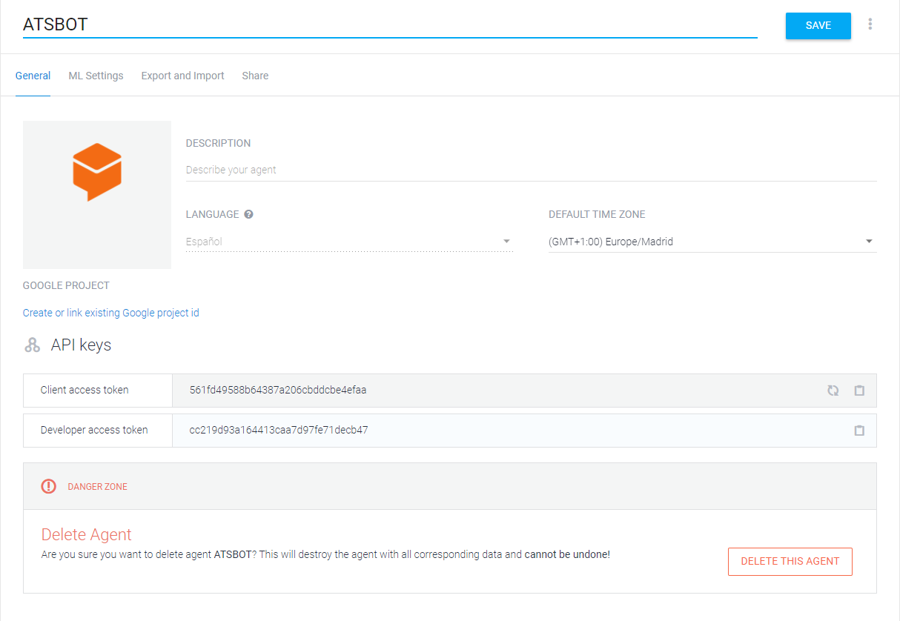</center>

#### Integración con _Facebook Messenger_
Una vez hecho esto, deberemos vincularlo con nuestra aplicación de _Facebook_, yendo al apartado _integrations_ de la plataforma _API.ai_, y seleccionaremos _Facebook Messenger_. Una vez elegido, se nos desplegará un menú como el siguiente, donde deberemos introducir los datos que nos solicite.

<center>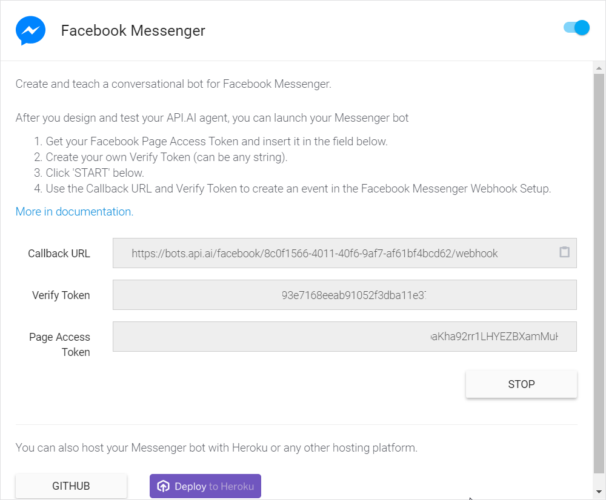</center>
El significado de los campos es el siguiente:
 - **Callback URL**
   URL que debemos configurar en la plataforma de desarrollo de _Facebook_, en el apartado de _Messenger_, para que cuando recibamos un mensaje del chat, haga una petición _POST_ hacia _API.ai_ para que éste interprete el mensaje y devuelva una respuesta. Cómo vemos, la URL apunta a los servidores de _API.ai_ que usando nuestro agente responderán al chat de forma automática.


 - **Verify Token**
   Cadena de caracteres que **debemos crear (preferiblemente de forma aleatoria)** como clave para que sólo el que la posea pueda usar nuestro agente. Hemos de escoger bien la clave, puesto que si escogemos una clave o token débil, cualquiera que conozca nuestra _Callback URL_ puede usar el _chatbot_ directamente sin pasar por _Facebook_ de forma no autorizada


 - **Page Access Token**
   Token que autentica a _API.ai_ frente a _Facebook_ para que pueda enviar respuestas a los mensajes.

Ahora debemos entrar en la plataforma de desarrollo de Facebook, e introducir un nuevo _webhook_ en el apartado de _Messenger_, con la _Callback URL_ indicada y _Verify Token_.

<center>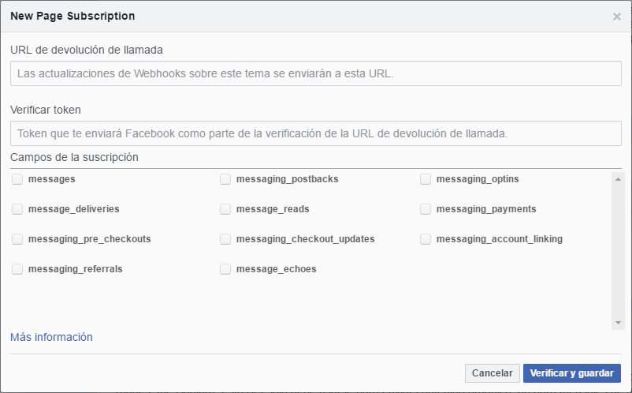</center>

Finalmente, nos dirigimos al apartado de _Generación de token_ en la misma página de _Messenger_ de la aplicación de Facebook en la plataforma de Facebook Developers y copiamos el _Page Access Token_ en el formulario de _API.ai_.
<center>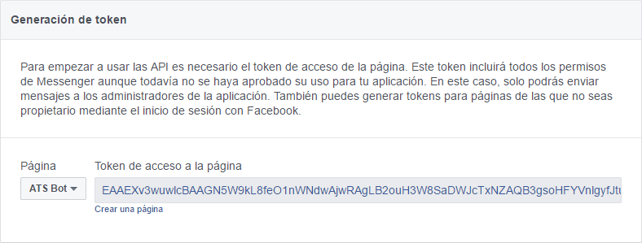</center>

#### Desarrollo del _chatbot_
Ahora debemos programar nuestro _chatbot_. Por ello el siguiente paso es crear unos cuantos [_intents_](https://docs.api.ai/docs/concept-intents), para que nuestro _chatbot_ reconozca intenciones del usuario y empiece a dar respuestas válidas, como por ejemplo el saludo en una conversación, algunas frases de cortesía y demás.

Por defecto, se encuentra el _Default Fallback intent_, que contestará al usuario frases para que el usuario vuelva a repetir la pregunta o texto de forma diferente puesto que se ejecutará cuando no se haya detectado ninguna otra intención.

<center>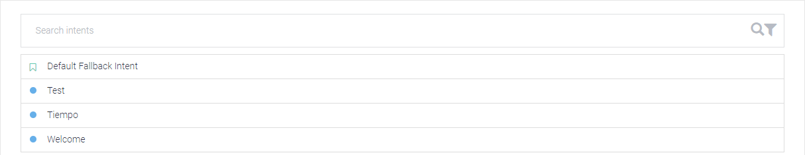</center>

Lo más básico es crear un _intent_ para reconocer saludos y dar respuesta. Dado un mensaje concreto del usuario (que el _chatbot_ intentará relacionar si es un mensaje similar), deberemos definir las posibles respuestas que dará nuestro agente.

<center>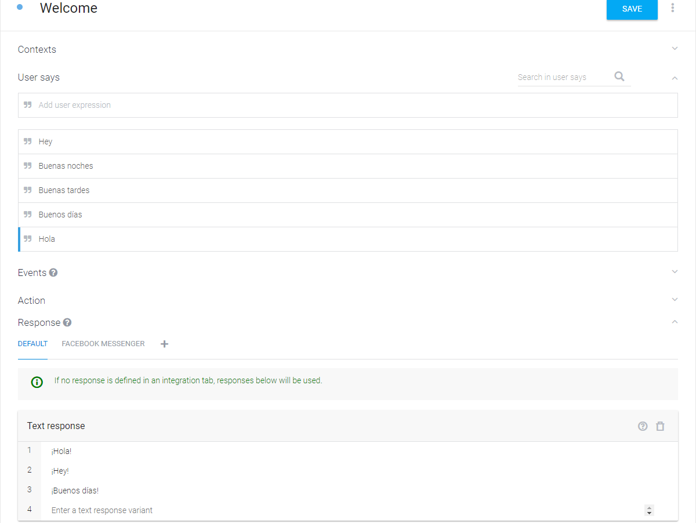</center>

Nosotros también crearemos un _intent_ para que nuestro _chatbot_ conteste a la pregunta:
```
Qué tiempo hace en <Ciudad>?
```
Y llamaremos a dicho _intent_ `Weather`. También podemos introducir otras frases para que reconozca dicho _intent_, como
```
Clima en <Ciudad>?
Hace frío en <Ciudad>?
```
Para que reconozca la ciudad, debemos escribir las anteriores frases con una ciudad de ejemplo y marcar la ciudad como una [entidad](https://docs.api.ai/docs/concept-entities). Las entidades definen conceptos y permiten relacionar las acciones o _intents_ con conceptos físicos o abstractos. Podemos definir entidades personalizadas o usar las que existen por defecto. En nuestro caso, usaremos una por defecto, llamada _\@sys-geocity_ que identifica ciudades.

Finalmente, debemos proporcionar una respuesta a la pregunta. Para ello, desarrollaremos un servicio web con API REST para que dada la ciudad que envíe _API.ai_ una vez interpretado el mensaje del usuario, nos devuelva el tiempo de dicha ciudad.

Debemos desarrollar un servicio web propio puesto que debe interpretar los mensajes que enviará _API.ai_ que vienen dado un [formato específico](https://docs.api.ai/docs/webhook), por lo que no podemos usar directamente una API REST para obtener el tiempo. Nuestro servicio web actuará de intermediario.

#### Webhooks en _API.ai_
Para que _API.ai_ envíe la solicitud del tiempo indicando la ciudad a nuestro servicio web, debemos de nuevo configurar un _webhook_ para que _API.ai_ solicite a nuestro servicio web la respuesta del tiempo.

Nos dirigimos al apartado de _fulfillment_ y creamos un nuevo _webhook_ del cual indicamos su URL. También nos permite usar autenticación para comprobar que _API.ai_ está autorizado a usar el webservice (igual que _Facebook Messenger_ con _API.ai_ en la integración realizada previamente), pero nosotros no lo configuraremos, simplemente introduciremos nuestra URL del _webservice_.

<center>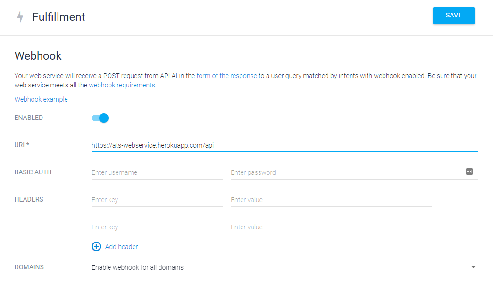</center>

> La URL del webservice la suponemos puesto que vamos a crear una aplicación en Heroku con nombre personalizado. En el caso de desconocerla, podemos realizar este paso de integración con _webhooks_ una vez creado el webservice y por lo tanto cuando conozcamos dicha URL

En último lugar, nos dirigimos al intent de _Weather_ y seleccionamos la casilla de _webhook_ para en el caso de recibir un mensaje con solicitud del estado meteorológico, solicitar al servicio web nuestro con el _webhook_ configurado la respuesta.

<center>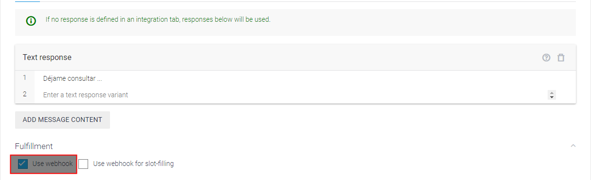</center>

## Creación de _webservice_ REST usando _Jersey, Jetty_ y publicado en _Heroku_
### Creación del _webservice_
_Jersey_ nos ofrece un arquetipo de _Maven_ preparado para desarrollar un servicio web de forma rápida, y además, con código extra (fichero _Procfile_) para poder una vez desarrollado locamente y probado, enviarlo para su publicación online a _Heroku_.

En la página de [_Getting started_](https://jersey.java.net/documentation/latest/getting-started.html) de _Jersey_ nos indican el comando a realizar para crear el proyecto usando dicho arquetipo de _Maven_:
```bash
mvn archetype:generate
    -DarchetypeArtifactId=jersey-heroku-webapp \
    -DarchetypeGroupId=org.glassfish.jersey.archetypes \
    -DinteractiveMode=false \
    -DgroupId=com.example \
    -DartifactId=simple-heroku-webapp \
    -Dpackage=com.example \
    -DarchetypeVersion=2.25.1
```
Una vez ejecutamos el comando, podemos empezar a desarrollar el sevicio web, importando el proyecto en nuestro IDE favorito, como _Eclipse_.

### Desarrollo del _webservice_
Podemos ver que en `com.domain.heroku.Main.java` tenemos un fichero que contiene código para ejecutar el servidor de aplicaciones JEE con nuestro _webservice_ ya publicado.

Pero el fichero interesante es `com.domain.resources.ApiResource.java`, dónde se encuentra un ejemplo de `GET` y `POST` de nuestro _webservice_
```java
@Path("api")
public class ApiResource {
    @GET
    @Produces(MediaType.APPLICATION_JSON)
    public Response getIt() {
        return Response.status(200).entity("{}").build();
    }

    @POST
    @Produces(MediaType.APPLICATION_JSON)
    public Response postIt(String req) {
        return Response.status(200).entity(req).build();
    }
}
```
El código indica que cuando realicemos una petición `GET` a nuestro servidor JEE en la URL `/api`, nos devolverá el _string_ `{}`, que al ser devuelto con tipo _JSON_, interpretará como un objeto _JSON_ vacío. En el caso del `POST`, devolverá los datos que reciba.

Con este ejemplo, ya podemos lanzar nuestro _webservice_ usando el comando
```bash
mvn clean install
```
Para compilar y
```bash
mvn jetty:run
```
Para ejecutar el servidor _Jetty_ con nuestro _webservice_ lanzado.

### Consumición del servicio web de meteorología conectado a _API.ai_
Tal y como hemos mencionado antes, nuestro _webservice_ ha de interpretar los mensajes que _API.ai_ nos envie mediante el _webhook_ que configuramos para responder el tiempo de la ciudad solicitada. El diagrama del sistema entonces se ampliaría al siguiente:

<center>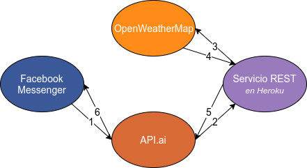</center>

#### _OpenWeatherMap_
El servicio REST que consumiremos para obtener el tiempo de una ciudad es [_OpenWeatherMap_](https://openweathermap.org), que según su [documentación](https://openweathermap.org/current) requiere que para obtener el tiempo de una ciudad, realicemos un `GET` a la siguiente URL
```bash
https://api.openweathermap.org/data/2.5/weather?q=London
```
Donde _London_ es la ciudad a consultar. También necesitamos añadir a estos _query parameters_ de la URL una _API key_ (parámetro `appid`) que podemos obtener registrándonos en _OpenWeatherMap_ y opcionalmente añadir el idioma de la respuesta mediante el parámetro `lang`, de manera que la URL a la que realizar el `GET` es
```
https://api.openweathermap.org/data/2.5/weather?q=London&lang=es&appid=<token>
```
#### Código para consumir el servicio
Para consumir el servicio, crearemos una nueva clase en el proyecto dónde con un método _main_ podremos comprobar localmente si podemos obtener correctamente el tiempo de una ciudad pasada por parámetro.

Usaremos la librería _JSON_ de `javax`, en su implementación de `Glassfish` para analizar la [respuesta proporcionada por _OpenWeatherMap_](http://samples.openweathermap.org/data/2.5/weather?q=London,uk&appid=b1b15e88fa797225412429c1c50c122a1), convirtiéndo el _String_ de respuesta en un objeto Java más fácil de manipular y acceder a los campos del obejto _JSON_. El código resultante es el siguiente:

```java
public class WeatherConsumer {
	public static void main(String[] args) {
		System.out.println(weather(args[0]));
	}
	public static String weather(String city) {
        // Cliente REST
		Client client = ClientBuilder.newClient();
        // Generación de URL
		String api_key = "<api_key>"; // esto no lo revelamos :P
		String URL = "http://api.openweathermap.org/data/2.5/weather";
		try {
			URL += "?q=" + URLEncoder.encode(city, "UTF-8");
			URL += "&lang=" + URLEncoder.encode("es", "UTF-8");
		} catch (UnsupportedEncodingException e) {
			e.printStackTrace();
		}
		URL += "&appid=" + api_key;

        // Petición GET
		WebTarget resource = client.target(URL);
		Builder request = resource.request();
		request.accept(MediaType.APPLICATION_JSON);
		Response response = request.get();

        // Análisis de la respuesta
		if (response.getStatusInfo().getFamily() == Family.SUCCESSFUL) {
            // Conversión String <-> JSON
		    JsonReader jsonReader = Json.createReader(new StringReader(
		    		response.readEntity(String.class)));
		    JsonObject json = jsonReader.readObject();
		    jsonReader.close();
            // Obtención del campo description, dentro del primer objeto
            // del array contenido en el campo "weather"
		    JsonArray weatherArray = json.getJsonArray("weather");
		    JsonObject weatherFirstObject = weatherArray.getJsonObject(0);
		    String weatherDescription = weatherFirstObject.getString("description");
		    // Devolución del resultado
		    return weatherDescription;
		} else {
		    System.out.println("ERROR: " + response.getStatus());
		    System.out.println(response.getEntity());
		}
		return "No se ha encontrado respuesta";
	}
}
```
Probamos el código localmente y comprobamos que efectivamente, devuelve el tiempo en dicha ciudad, en castellano.

#### Respondiendo a _API.ai_
El último paso es responder al `POST` de _API.ai_ con el tiempo, obteniendo primero la ciudad dados los datos proporcionados por _API.ai_ y creando una respuesta interpretable por _API.ai_

##### Interpretando los datos de _API.ai_
Usando la [documentación de _API.ai_](https://docs.api.ai/docs/webhook), podemos ver que los datos en formato _JSON_ que nos enviará _API.ai_ tienen un objeto `parameters` dentro del campo `result`, en el cual aparecen las entidades identificadas en el mensaje, en éste caso, la ciudad, del tipo `sys-geocity`.

Para obtener la ciudad, pues, debemos convertir los datos que recibamos de _API.ai_ en un objeto Java para acceder al campo deseado y llamar a nuestro cliente consumidor del servicio web de _OpenWeatherMap_ para obtener el tiempo.

Modificamos así el código del `POST` de ejemplo del proyecto y introducimos el siguiente código:
```java
@POST
@Produces(MediaType.APPLICATION_JSON)
public Response post(String req) {
	// Read JSON
	JsonReader jsonReader = Json.createReader(new StringReader(req));
    JsonObject json = jsonReader.readObject();
    jsonReader.close();
    String city = json
            .getJsonObject("result")
    		.getJsonObject("parameters")
    		.getString("geo-city");
	String weather = WeatherConsumer.weather(city);
    // [...]
}
```
De manera que ahora en la variable `city` tendremos la ciudad a devolver el tiempo y mediante la llamada a nuestro consumidor del servicio web, obtendremos el resultado en la variable `weather`.

##### Devolviendo el resultado a _API.ai_
Siguiendo la documentación de _API.ai_ debemos devolver un objeto _JSON_ como respuesta a la petición que contenga el texto a devolver al usuario en el campo `speech` y `displayText`.

Continuamos el desarrollo de la función anterior para elaborar la respuesta.
```java
@POST
@Produces(MediaType.APPLICATION_JSON)
public Response post(String req) {
    // [...]
    // Elaboramos respuesta
	JsonBuilderFactory responseFactory = Json.createBuilderFactory(null);
	JsonObject response = responseFactory.createObjectBuilder()
			.add("speech", weather)
			.add("displayText", weather)
			.build();
    // Convertimos respuesta a String
	String responseString = response.toString();
    // Enviamos respuesta
	return Response.status(200).entity(responseString).build();
}
```
Ahora sólo nos queda publicar el servicio web en _Heroku_ para que _API.ai_ pueda usar el _webhook_

### Desplegando el servicio en _Heroku_
Para no tener el servidor con el _webservice_ en nuestra máquina local, usaremos [_Heroku_](https://dashboard.heroku.com) que nos permitirá tener de forma gratuita nuestro servicio web alojado en una máquina virtual de [_Amazon Web Services_](https://aws.amazon.com/es).

Para ello, primero debemos instalar las [_Heroku CLI Tools_](https://devcenter.heroku.com/articles/heroku-cli) para poder ejecutar comandos que nos permitan comunicarnos con _Heroku_ para lanzar nuestras aplicaciones.

En primer lugar, debemos iniciar sesión desde el terminal (debemos habernos registrado previamente)
```bash
heroku login
```
Una vez iniciada la sesión, creamos una nueva aplicación donde lanzaremos nuestro proyecto. Para ello, nos situamos en el directorio del proyecto y ejecutamos el siguiente comando
```bash
heroku create ats-webservice
```
Esto nos creará una aplicación disponible en la URL
```
https://ats-webservice.herokuapp.com
```
Para enviar nuestro proyecto allí, debemos realizar un commit con los cambios y subirlo al remoto de _Heroku_
```
git add . && git commit && git push heroku master
```
También podemos vincular a través del panel de administración web de Heroku, un repositorio de _GitHub_ para que cuando se realice un `push` a una determinada `branch`, _Heroku_ automáticamente actualice el proyecto con el último _commit_ de la rama.

<center>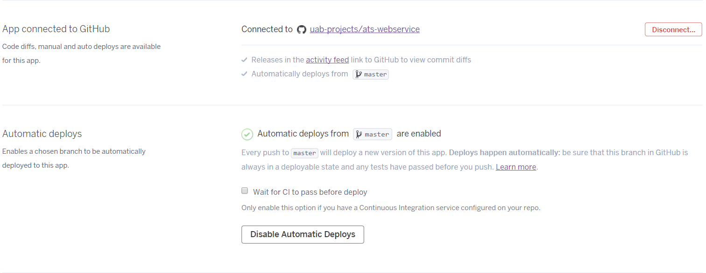</center>


## Detalle de comunicaciones
Revisemos de nuevo las comunicaciones con APIs del tipo REST en formato JSON que ocurren en nuestro sistema:

<center></center>

Recordamos que las primeras comunicaciones se realizan desde _Facebook Messenger_ hacia _API.ai_ para que éste interprete el lenguaje natural. A pesar de que la integración es automática, los mensajes que se intercambian también son una API en formato JSON usando webservices (recordemos que configuramos un _webhook_).

En segundo lugar, _API.ai_ si detecta que la conversación solicita el tiempo, se comunicará con nuestro servicio web en _Heroku_ para obtener el tiempo.

Y finalmente nuestro servicio web usa una API REST en formato JSON de _OpenWeatherMap_ para obtener el estado meteorológico

### API de _Facebook Messenger_
#### Notificación de nuevos mensajes
En cuanto a _Facebook Messenger_, cuando un usuario introduce un mensaje, tenemos un _webhook_ enlazado al evento de _message_. De ésta forma, cuando un usuario envía un mensaje, _Facebook Messenger_, lanza el evento _message_ y sus consecuentes _webhooks_, enviando en este caso a _API.ai_ un documento _JSON_ usando un `POST` HTTP a nuestra _Callback URL_ de _API.ai_ que configuramos previamente con los datos del mensaje.

El formato de dicho documento es el siguiente:
```json
{
    "sender": {
        "id": "USER_ID"
    },
    "recipient": {
        "id": "PAGE_ID"
    },
    "timestamp": 1458692752478,
    "message": {
        "mid": "mid.1457764197618:41d102a3e1ae206a38",
        "text": "hello, world!",
        "quick_reply": {
            "payload": "DEVELOPER_DEFINED_PAYLOAD"
        },
        "attachments": [{
            "type":"image",
            "payload": {
                "url":"IMAGE_URL"
            }
        }]
    }
}
```
Dónde `sender` nos identifica el usuario que solicita el mensaje (con una ID de _Facebook_ que identifica su perfil), `recipient` el destinatario (seáse la página de _Facebook_ dónde envío el mensaje), `timestamp` el tiempo en segundos desde la época UNIX, y `message` un subdocumento _JSON_ que contiene no sólo el texto que envío el usuario (campo `text`), sino también el identificador del mensaje (campo `mid`) además de otros campos no relevantes.

En el caso de tener archivos adjuntos, como imágenes o audio, un campo llamado `attachments` dentro del subdocumento `message` contendría estos en forma de `array`. Cada `attachment`,  contendria el tipo (`video`, `image`, `audio`...) en el campo `type`, y su ubicación en el subdocument `payload`, normalmente, la `URL` para acceder a éste

#### Envío de respuestas
Para responder a los mensajes recibidos, no debemos responder al `POST` con datos, sino realizar nosotros un `POST` a la siguiente `URL`:
```
https://graph.facebook.com/v2.6/me/messages?access_token=<PAGE_ACCESS_TOKEN>
```
Con la respuesta o mensaje a enviar, en un documento _JSON_ del siguiente formato:
```json
{
    "recipient": {
        "id": "USER_ID"
    },
    "message": {
        "text": "hello, world!"
    }
}
```
Dónde `recipient.id` es el destinatario (lo identificamos por el `sender.id` del document JSON para recibir mensajes) y `message.text` es el texto a enviar como respuesta.

> Todo este proceso lo realiza de forma automágica _API.ai_ para gestionar la integración con _Facebook_, pero en el caso de querer características adicionales, deberíamos de integrar esta _API_ en nuestro _webservice_ para poder comunicarnos con _Facebook Messenger_. Luego podríamos seguir usando _API.ai_ para procesado de lenguaje natural usando su _API_ de comunicaciones.

### API de API.ai
El siguiente paso es la comunicación mediante _webhook_ de _API.ai_ con nuestro _webservice_ para proporcionar una respuesta válida a la pregunta sobre el estado meteorológico. Para ello, _API.ai_ realizará una petición _POST_ a nuestro _webservice_ en _Heroku_ solicitando el estado meteorológico de una ciudad indicada, que esperará como respuesta a dicho _POST_ la respuesta a enviar al usuario finalmente.
#### Notificación de API.ai a nuestro _webservice_
El formato de documento que usa _API.ai_ para notificarnos una nueva solicitud del estado climatológico es:
```json
{
    "originalRequest": {
        "source": "facebook",
        "data": {
            "sender": {
                "id": "1489813491089329"
            },
            "recipient": {
                "id": "1279462395495348"
            },
            "message": {
                "mid": "mid.$cAASLqmo2AKxiFRbtuVb49GlQTWWv",
                "text": "Que tiempo hace en Mollet?",
                "seq": 125729
            },
            "timestamp": 1.494175819193E12
        }
    },
    "id": "40a543cf-5543-4b3c-a942-dbb6a47173ad",
    "timestamp": "2017-05-07T16:50:19.621Z",
    "lang": "es",
    "result": {
        "source": "agent",
        "resolvedQuery": "Que tiempo hace en Mollet?",
        "speech": "",
        "action": "",
        "actionIncomplete": false,
        "parameters": {
            "geo-city": "Mollet"
        },
        "contexts": [{
            "name": "generic",
            "parameters": {
                "geo-city": "Mollet",
                "geo-city.original": "Mollet",
                "facebook_sender_id": "1489813491089329"
            },
            "lifespan": 3
        }],
        "metadata": {
            "intentId": "163a1f8a-aacd-4ce9-a81f-13d4d04dcc28",
            "webhookUsed": "true",
            "webhookForSlotFillingUsed": "false",
            "intentName": "Tiempo"
        },
        "fulfillment": {
            "speech": "Déjame consultar ...",
            "messages": [{
                "type": 0,
                "speech": "Déjame consultar ..."
            }]
        },
        "score": 0.92
    },
    "status": {
        "code": 200,
        "errorType": "success"
    },
    "sessionId": "a639035c-ce83-42fb-be16-e52237cd45f6"
}
```
Vemos que en el documento que nos envía _API.ai_ podemos obtener la _request_ original de _Facebook_, usando su API, en el campo `originalRequest`. En el campo `lang` se nos indica el código del idioma de la petición, y lo más importante se encuentra el el subdocumento del campo `result`, en el que aparece el resultado del procesado del lenguaje natural. Allí vemos que podemos obtener la ciudad que el usuario ha indicado en `parameters.geo-city` y que el _intent_ es el de obtener el tiempo en `metadata.intentName`.

#### Respuesta a _API.ai_
Como respuesta a dicho mensaje, debemos responder un documento _JSON_ con el formato especificado en la [_API_ de _webhooks_ de _API.ai_](https://docs.api.ai/docs/webhook#webhook-example). La respuesta debe producirse en menos de 5 esgundos para poder tenerse en cuenta, de lo contrario, se responderá un texto (o varios) por defecto configurable en _API.ai_
```json
{
    "speech": "Algo de nubes",
    "displayText": "Algo de nubes"
}
```
La respuesta debe contener dos campos, `speech` y `displayText` con el texto a devolver al usuario. La diferencia entre estos dos campos es que el `speech` es el texto a pronunciar en el caso que se vaya a devolver un texto hablado y `displayText` el texto escrito a mostrar. **Ambos deben estar especificados en el documento, aunque sean iguales** para que _API.ai_ pueda procesar la respuesta.


### API de OpenWeatherMap
La última _API_ es la que usa nuestro _webservice_ para comunicarse con _OpenWeatherMap_ y obtener el tiempo de una ciudad.

#### Solicitud de tiempo
Para solicitar el estado meteorológico de una ciudad, debemos hacer una petición `GET` HTTP a la URL
```
https://api.openweathermap.org/data/2.5/weather?q=London&lang=es&appid=<token>
```
En la URL se indican los parámetros como la ciudad, la _API key_ para autorizarnos como solicitantes lícitos (y restringirnos el servicio si realizamos más peticiones de la cuenta) o el idioma.

> Es importante no publicar la llave API en un repositorio público, por lo que podemos hacer para proteger dicha llave es guardar la llave en una variable de entorno que [configuraremos en _Heroku_](https://devcenter.heroku.com/articles/heroku-local#set-up-your-local-environment-variables) y codificar en _Java_ que la llave API la obtenga leyendo dicha variable de entorno

#### Respuesta a la solicitud del tiempo
La respuesta a dicha petición es un documento _JSON_ con el siguiente formato:
```json
{
    "coord": {
        "lon": -0.13,
        "lat": 51.51
    },
    "weather": [{
        "id": 300,
        "main": "Drizzle",
        "description": "light intensity drizzle",
        "icon": "09d"
    }],
    "base": "stations",
    "main": {
        "temp": 280.32,
        "pressure": 1012,
        "humidity": 81,
        "temp_min": 279.15,
        "temp_max": 281.15
    },
    "visibility": 10000,
    "wind": {
        "speed": 4.1,
        "deg": 80
    },
    "clouds": {
        "all": 90
    },
    "dt": 1485789600,
    "sys": {
        "type": 1,
        "id": 5091,
        "message": 0.0103,
        "country": "GB",
        "sunrise": 1485762037,
        "sunset": 1485794875
    },
    "id": 2643743,
    "name": "London",
    "cod": 200
}
```
Dónde el campo que aprovecharemos será el `weather.main` que contiene una descripción del tiempo en la ciudad en forma de texto en el idioma seleccionado
## Test del _chatbot_
### Enlace del _chatbot_
El _chatbot_ puede usarse desde el siguiente enlace:
<center>https://www.messenger.com/t/1279462395495348</center>
Finalmente, probamos que nuestro _chatbot_ ya está listo y operativo

<center>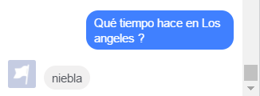</center>


### Continuación del desarrollo
A partir de aquí, podemos comenzar a desarrollar para ofrecer una experiencia de usuario más cómoda, cercana y divertida

<center>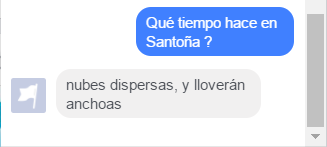</center>

<center></center>

## Repositorio
El código de nuestro _webservice_ se encuentra en _GitHub_ en el siguiente repositorio:
<center>https://github.com/uab-projects/ats-webservice</center>
Esta misma documentación se encuentra allí accesible en formato _Markdown_, _PDF_ y _HTML_ en la rama `gh-pages` y es visible en:

<center>https://uab.codes/ats-webservice/</center>
